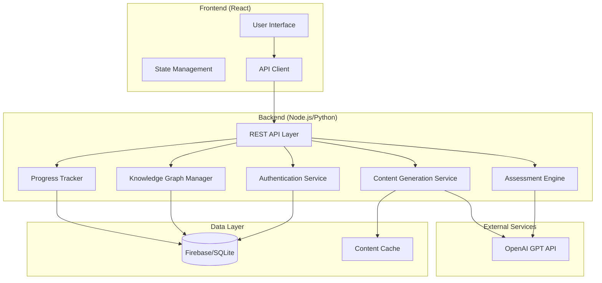

# Design Document: Adaptive Learning Assistant

## Overview

The Adaptive Learning Assistant is a full-stack web application that leverages AI to create personalized learning experiences. The system consists of a React-based frontend, a Node.js/Python backend with RESTful APIs, and integrates with OpenAI's GPT API for content generation. The architecture emphasizes modularity, with clear separation between content generation, assessment logic, progress tracking, and knowledge graph management.

The system operates on a cycle: students request learning materials for a topic, study the content, answer adaptive questions, receive targeted feedback on mistakes, and progress through difficulty levels until mastery is achieved. All progress is tracked in a knowledge graph structure that captures relationships between concepts and individual mastery levels.

## Architecture

### System Components



### Data Flow

1. **Learning Material Generation Flow:**
   - Student requests topic → API authenticates → Content Service checks cache → If not cached, calls AI API → Stores in cache → Returns to frontend → Updates knowledge graph

2. **Question Generation and Assessment Flow:**
   - Student requests question → Assessment Engine determines difficulty → Calls AI API with difficulty context → Returns question → Student submits answer → Assessment Engine evaluates → Updates progress and knowledge graph → Determines next action (advance, remediate, or continue)

3. **Progress Tracking Flow:**
   - Every student action → Progress Tracker records event → Updates database → Knowledge Graph Manager updates mastery levels and relationships → Persists to database

## Components and Interfaces

### Frontend Components

#### 1. TopicInputComponent
**Responsibility:** Capture and validate topic input from students

**Interface:**
```typescript
interface TopicInputProps {
  onTopicSubmit: (topic: string) => Promise<void>;
  isLoading: boolean;
}

interface TopicInputState {
  topicName: string;
  validationError: string | null;
}
```

**Behavior:**
- Validates topic name is non-empty and contains valid characters
- Displays loading state during API calls
- Shows error messages for invalid input

#### 2. LearningMaterialDisplay
**Responsibility:** Render formatted learning content

**Interface:**
```typescript
interface LearningMaterialProps {
  content: LearningMaterial;
  onStartPractice: () => void;
}

interface LearningMaterial {
  topicId: string;
  title: string;
  introduction: string;
  keyConcepts: string[];
  examples: string[];
  generatedAt: Date;
}
```

#### 3. QuestionComponent
**Responsibility:** Display questions and capture student answers

**Interface:**
```typescript
interface QuestionProps {
  question: Question;
  onAnswerSubmit: (answer: Answer) => Promise<void>;
  isLoading: boolean;
}

interface Question {
  id: string;
  topicId: string;
  text: string;
  type: 'multiple_choice' | 'true_false' | 'short_answer';
  options?: string[];
  difficulty: 'Easy' | 'Medium' | 'Hard';
}

interface Answer {
  questionId: string;
  studentAnswer: string;
  timestamp: Date;
}
```

#### 4. ProgressDashboard
**Responsibility:** Visualize student progress and mastery levels

**Interface:**
```typescript
interface ProgressDashboardProps {
  studentId: string;
  progressData: ProgressData;
}

interface ProgressData {
  topics: TopicProgress[];
  overallMastery: number;
  studySessions: SessionSummary[];
}

interface TopicProgress {
  topicId: string;
  topicName: string;
  masteryLevel: number;
  currentDifficulty: 'Easy' | 'Medium' | 'Hard';
  questionsAttempted: number;
  questionsCorrect: number;
}
```

### Backend Services

#### 1. Authentication Service
**Responsibility:** Handle user authentication and session management

**Interface:**
```python
class AuthenticationService:
    def register_student(email: str, password: str) -> StudentId
    def login(email: str, password: str) -> SessionToken
    def verify_session(token: SessionToken) -> StudentId
    def logout(token: SessionToken) -> bool
    def hash_password(password: str) -> str
    def verify_password(password: str, hashed: str) -> bool
```

**Implementation Notes:**
- Use bcrypt or argon2 for password hashing
- Generate JWT tokens for session management
- Implement token expiration (24 hours)
- Store session data in database

#### 2. Content Generation Service
**Responsibility:** Generate learning materials using AI

**Interface:**
```python
class ContentGenerationService:
    def __init__(ai_client: AIClient, cache: ContentCache)
    
    def generate_learning_material(topic: str, student_id: StudentId) -> LearningMaterial
    def get_cached_material(topic: str) -> Optional[LearningMaterial]
    def cache_material(topic: str, material: LearningMaterial) -> None
    def format_material(raw_content: str) -> LearningMaterial
```

**AI Prompt Strategy:**
- System prompt: "You are an expert educator creating concise, clear learning materials for students."
- User prompt template: "Create a comprehensive but concise lesson on {topic}. Include: 1) Introduction, 2) Key concepts, 3) Examples. Keep it between 200-800 words."

#### 3. Assessment Engine
**Responsibility:** Generate questions, evaluate answers, and manage difficulty progression

**Interface:**
```python
class AssessmentEngine:
    def __init__(ai_client: AIClient, progress_tracker: ProgressTracker)
    
    def generate_question(topic: str, difficulty: Difficulty, student_id: StudentId) -> Question
    def evaluate_answer(question: Question, student_answer: str) -> EvaluationResult
    def determine_next_difficulty(student_id: StudentId, topic: str) -> Difficulty
    def should_advance_difficulty(recent_results: List[EvaluationResult]) -> bool
    def identify_knowledge_gap(question: Question, student_answer: str) -> KnowledgeGap
```

**Structures:**
```python
class Difficulty(Enum):
    EASY = 1
    MEDIUM = 2
    HARD = 3

class EvaluationResult:
    question_id: str
    is_correct: bool
    correct_answer: str
    explanation: str
    knowledge_gap: Optional[KnowledgeGap]
    timestamp: datetime

class KnowledgeGap:
    concept: str
    description: str
    related_topics: List[str]
```

**Difficulty Progression Logic:**
- Track last 3 answers for current difficulty
- If all 3 correct → advance difficulty
- If any incorrect → trigger remediation
- At Hard difficulty with 3 correct → mark as mastered

#### 4. Progress Tracker
**Responsibility:** Record and retrieve student progress data

**Interface:**
```python
class ProgressTracker:
    def __init__(database: Database)
    
    def record_answer(student_id: StudentId, question_id: str, result: EvaluationResult) -> None
    def get_student_progress(student_id: StudentId) -> ProgressData
    def get_topic_progress(student_id: StudentId, topic: str) -> TopicProgress
    def create_study_session(student_id: StudentId) -> SessionId
    def end_study_session(session_id: SessionId) -> None
    def get_recent_results(student_id: StudentId, topic: str, count: int) -> List[EvaluationResult]
```

#### 5. Knowledge Graph Manager
**Responsibility:** Build and maintain knowledge graph structure

**Interface:**
```python
class KnowledgeGraphManager:
    def __init__(database: Database)
    
    def create_topic_node(topic: str, parent_topic: Optional[str]) -> NodeId
    def update_mastery_level(student_id: StudentId, topic: str, mastery: float) -> None
    def get_mastery_level(student_id: StudentId, topic: str) -> float
    def add_relationship(parent_topic: str, child_topic: str, relationship_type: str) -> None
    def get_prerequisites(topic: str) -> List[str]
    def get_related_topics(topic: str) -> List[str]
    def calculate_mastery(student_id: StudentId, topic: str) -> float
```

**Graph Structure:**
```python
class TopicNode:
    id: str
    name: str
    parent_id: Optional[str]
    children: List[str]
    created_at: datetime

class MasteryRecord:
    student_id: str
    topic_id: str
    mastery_level: float  # 0-100
    questions_attempted: int
    questions_correct: int
    current_difficulty: Difficulty
    last_updated: datetime
```

**Mastery Calculation:**
- Base score: (correct_answers / total_attempts) * 100
- Difficulty multiplier: Easy (1.0), Medium (1.2), Hard (1.5)
- Consistency bonus: +10 if last 5 answers all correct
- Final mastery = min(100, base_score * difficulty_multiplier + consistency_bonus)

#### 6. Mini Lesson Generator
**Responsibility:** Create targeted explanations for knowledge gaps

**Interface:**
```python
class MiniLessonGenerator:
    def __init__(ai_client: AIClient)
    
    def generate_mini_lesson(knowledge_gap: KnowledgeGap, context: str) -> MiniLesson
    def format_mini_lesson(raw_content: str) -> MiniLesson

class MiniLesson:
    concept: str
    explanation: str
    example: str
    practice_tip: str
    generated_at: datetime
```

**AI Prompt Strategy:**
- System prompt: "You are a patient tutor helping a student understand a specific concept they struggled with."
- User prompt template: "The student made a mistake related to {concept}. Provide a brief, clear explanation (100-300 words) with one example."

## Data Models

### Database Schema

#### Students Table
```sql
CREATE TABLE students (
    id UUID PRIMARY KEY,
    email VARCHAR(255) UNIQUE NOT NULL,
    password_hash VARCHAR(255) NOT NULL,
    created_at TIMESTAMP DEFAULT CURRENT_TIMESTAMP,
    last_login TIMESTAMP
);
```

#### Sessions Table
```sql
CREATE TABLE sessions (
    id UUID PRIMARY KEY,
    student_id UUID REFERENCES students(id),
    token VARCHAR(512) UNIQUE NOT NULL,
    created_at TIMESTAMP DEFAULT CURRENT_TIMESTAMP,
    expires_at TIMESTAMP NOT NULL,
    is_active BOOLEAN DEFAULT TRUE
);
```

#### Topics Table
```sql
CREATE TABLE topics (
    id UUID PRIMARY KEY,
    name VARCHAR(255) NOT NULL,
    parent_topic_id UUID REFERENCES topics(id),
    created_at TIMESTAMP DEFAULT CURRENT_TIMESTAMP,
    UNIQUE(name)
);
```

#### Learning Materials Table
```sql
CREATE TABLE learning_materials (
    id UUID PRIMARY KEY,
    topic_id UUID REFERENCES topics(id),
    content_json TEXT NOT NULL,
    generated_at TIMESTAMP DEFAULT CURRENT_TIMESTAMP,
    cache_key VARCHAR(255) UNIQUE
);
```

#### Questions Table
```sql
CREATE TABLE questions (
    id UUID PRIMARY KEY,
    topic_id UUID REFERENCES topics(id),
    question_text TEXT NOT NULL,
    question_type VARCHAR(50) NOT NULL,
    options_json TEXT,
    correct_answer TEXT NOT NULL,
    explanation TEXT NOT NULL,
    difficulty VARCHAR(20) NOT NULL,
    created_at TIMESTAMP DEFAULT CURRENT_TIMESTAMP
);
```

#### Student Answers Table
```sql
CREATE TABLE student_answers (
    id UUID PRIMARY KEY,
    student_id UUID REFERENCES students(id),
    question_id UUID REFERENCES questions(id),
    student_answer TEXT NOT NULL,
    is_correct BOOLEAN NOT NULL,
    answered_at TIMESTAMP DEFAULT CURRENT_TIMESTAMP,
    session_id UUID
);
```

#### Mastery Records Table
```sql
CREATE TABLE mastery_records (
    id UUID PRIMARY KEY,
    student_id UUID REFERENCES students(id),
    topic_id UUID REFERENCES topics(id),
    mastery_level FLOAT NOT NULL CHECK (mastery_level >= 0 AND mastery_level <= 100),
    questions_attempted INT DEFAULT 0,
    questions_correct INT DEFAULT 0,
    current_difficulty VARCHAR(20) NOT NULL,
    last_updated TIMESTAMP DEFAULT CURRENT_TIMESTAMP,
    UNIQUE(student_id, topic_id)
);
```

#### Study Sessions Table
```sql
CREATE TABLE study_sessions (
    id UUID PRIMARY KEY,
    student_id UUID REFERENCES students(id),
    started_at TIMESTAMP DEFAULT CURRENT_TIMESTAMP,
    ended_at TIMESTAMP,
    topics_studied TEXT[]
);
```

#### Topic Relationships Table
```sql
CREATE TABLE topic_relationships (
    id UUID PRIMARY KEY,
    parent_topic_id UUID REFERENCES topics(id),
    child_topic_id UUID REFERENCES topics(id),
    relationship_type VARCHAR(50) NOT NULL,
    created_at TIMESTAMP DEFAULT CURRENT_TIMESTAMP,
    UNIQUE(parent_topic_id, child_topic_id)
);
```

### API Endpoints

#### Authentication Endpoints
- `POST /api/auth/register` - Register new student
- `POST /api/auth/login` - Authenticate and create session
- `POST /api/auth/logout` - End session
- `GET /api/auth/verify` - Verify session token

#### Learning Material Endpoints
- `POST /api/materials/generate` - Generate learning material for topic
- `GET /api/materials/:topicId` - Retrieve cached learning material

#### Question Endpoints
- `POST /api/questions/generate` - Generate question for topic and difficulty
- `POST /api/questions/:questionId/answer` - Submit answer for evaluation

#### Progress Endpoints
- `GET /api/progress/:studentId` - Get overall student progress
- `GET /api/progress/:studentId/topic/:topicId` - Get topic-specific progress
- `GET /api/sessions/:studentId` - Get study session history

#### Knowledge Graph Endpoints
- `GET /api/knowledge-graph/:studentId` - Get student's knowledge graph
- `GET /api/topics/:topicId/prerequisites` - Get prerequisite topics
- `GET /api/topics/:topicId/related` - Get related topics

## Correctness Properties

*A property is a characteristic or behavior that should hold true across all valid executions of a system—essentially, a formal statement about what the system should do. Properties serve as the bridge between human-readable specifications and machine-verifiable correctness guarantees.*


### Property 1: Learning Material Structure Completeness
*For any* generated learning material, it must contain all required sections: introduction, key concepts, and examples, with each section being non-empty.
**Validates: Requirements 1.2, 9.1**

### Property 2: Topic History Persistence
*For any* topic request by a student, after the learning material is generated, that topic must appear in the student's learning history.
**Validates: Requirements 1.3**

### Property 3: Invalid Topic Rejection
*For any* invalid topic name (empty string, whitespace-only, or containing only special characters), the system must return an error and not generate learning material.
**Validates: Requirements 1.4**

### Property 4: Valid Topic Acceptance
*For any* string containing only alphanumeric characters, spaces, and common punctuation (.,!?-), the system must accept it as a valid topic name.
**Validates: Requirements 1.5**

### Property 5: Question Structure Completeness
*For any* generated question, it must have exactly one difficulty level from {Easy, Medium, Hard}, a non-empty question text, a correct answer, and an explanation.
**Validates: Requirements 2.2, 2.3**

### Property 6: Difficulty Advancement on Success
*For any* student at a given difficulty level who answers 3 consecutive questions correctly, the system must advance them to the next higher difficulty level (Easy→Medium, Medium→Hard).
**Validates: Requirements 3.1, 3.5**

### Property 7: Valid Difficulty Transitions
*For any* difficulty level change, the transition must follow the valid progression: Easy→Medium or Medium→Hard, never skipping levels or moving backward.
**Validates: Requirements 3.3**

### Property 8: Remediation on Incorrect Answer
*For any* incorrect answer submitted by a student, the system must generate a mini lesson before presenting the next question.
**Validates: Requirements 3.2, 4.2**

### Property 9: Mastery Achievement at Hard Level
*For any* student at Hard difficulty level who answers 3 consecutive questions correctly, the system must mark the topic as mastered (mastery level ≥ 90).
**Validates: Requirements 3.4**

### Property 10: Knowledge Gap Identification
*For any* incorrect answer, the evaluation result must include a knowledge gap object with a non-empty concept description.
**Validates: Requirements 4.1**

### Property 11: Mini Lesson Length Constraint
*For any* generated mini lesson, its word count must be less than the word count of the full learning material for the same topic.
**Validates: Requirements 4.4**

### Property 12: Follow-up Question After Remediation
*For any* completed mini lesson, the system must generate a new question related to the same concept before allowing progression.
**Validates: Requirements 4.5**

### Property 13: Session State Round-Trip
*For any* student session state (current topic, difficulty level, question history), saving the state, ending the session, and then restoring it must produce an equivalent state.
**Validates: Requirements 5.3**

### Property 14: Study Session Timestamp Presence
*For any* study session record in the database, it must have a non-null timestamp indicating when it was created.
**Validates: Requirements 5.4**

### Property 15: Answer History Completeness
*For any* question answered by a student, that answer must appear in the student's complete answer history with the correct question ID, answer text, and result.
**Validates: Requirements 5.2, 5.5**

### Property 16: Knowledge Graph Node Creation
*For any* new topic introduced to a student, a corresponding node must exist in the knowledge graph with that topic's name.
**Validates: Requirements 6.1**

### Property 17: Knowledge Graph Consistency
*For any* assessment completion that changes mastery level, the knowledge graph must be updated in the database before the API returns success to the client.
**Validates: Requirements 6.2, 6.5**

### Property 18: Topic Relationship Representation
*For any* parent-child topic relationship defined in the system, there must be a corresponding edge in the knowledge graph connecting those nodes.
**Validates: Requirements 6.3**

### Property 19: Prerequisite Query Functionality
*For any* knowledge gap identified, the system must query the knowledge graph to retrieve prerequisite topics for remediation.
**Validates: Requirements 6.4**

### Property 20: Mastery Score Range Constraint
*For any* calculated mastery level, the score must be a number between 0 and 100 (inclusive).
**Validates: Requirements 7.1**

### Property 21: Mastery Calculation Factors
*For any* two students with the same number of correct answers, the student who answered harder questions must have a higher or equal mastery score.
**Validates: Requirements 7.2**

### Property 22: Mastery Threshold Marking
*For any* topic where a student's mastery level reaches or exceeds 90, that topic must be marked as mastered in the database.
**Validates: Requirements 7.3**

### Property 23: Mastery Update on Answer Submission
*For any* answer submission, the student's mastery level for that topic must be recalculated and updated before the response is returned.
**Validates: Requirements 7.4**

### Property 24: Individual Topic Mastery Display
*For any* topic with subtopics, each topic and subtopic must have its own separate mastery level value in the progress data.
**Validates: Requirements 7.5**

### Property 25: Password Hashing Security
*For any* student account created, the stored password in the database must not match the plaintext password provided during registration.
**Validates: Requirements 8.1**

### Property 26: Session Creation on Login
*For any* successful login with valid credentials, the system must create a new session record with a unique token.
**Validates: Requirements 8.2**

### Property 27: Data Isolation Between Students
*For any* two different students, querying progress data with one student's credentials must never return data belonging to the other student.
**Validates: Requirements 8.3**

### Property 28: Session Invalidation on Logout
*For any* session token, after logout is called with that token, subsequent requests using that token must be rejected as unauthorized.
**Validates: Requirements 8.4**

### Property 29: Session Expiration After Timeout
*For any* session created more than 24 hours ago without activity, requests using that session token must be rejected as expired.
**Validates: Requirements 8.5**

### Property 30: Content Caching Idempotence
*For any* topic, generating learning material twice should return identical content (from cache on the second request).
**Validates: Requirements 9.4**

### Property 31: Learning Material Length Constraint
*For any* generated learning material, the word count must be between 200 and 800 words (inclusive).
**Validates: Requirements 9.5**

### Property 32: Question Format Diversity
*For any* set of 10 or more questions generated for a topic, at least two different question formats (multiple choice, true/false, or short answer) must be present.
**Validates: Requirements 10.1**

### Property 33: Question Uniqueness Within Session
*For any* study session, all questions presented must have unique question IDs (no exact duplicates).
**Validates: Requirements 10.3**

## Error Handling

### Error Categories

1. **Authentication Errors**
   - Invalid credentials (401 Unauthorized)
   - Expired session token (401 Unauthorized)
   - Missing authentication token (401 Unauthorized)
   - Insufficient permissions (403 Forbidden)

2. **Validation Errors**
   - Invalid topic name format (400 Bad Request)
   - Missing required fields (400 Bad Request)
   - Invalid difficulty level (400 Bad Request)
   - Invalid answer format (400 Bad Request)

3. **AI Service Errors**
   - AI API timeout (504 Gateway Timeout)
   - AI API rate limit exceeded (429 Too Many Requests)
   - AI API returns invalid response (502 Bad Gateway)
   - AI API unavailable (503 Service Unavailable)

4. **Database Errors**
   - Connection failure (500 Internal Server Error)
   - Query timeout (500 Internal Server Error)
   - Constraint violation (409 Conflict)
   - Record not found (404 Not Found)

5. **Business Logic Errors**
   - Cannot advance difficulty (already at maximum)
   - Cannot generate question (no topic context)
   - Session already ended
   - Topic already mastered

### Error Response Format

All errors should follow a consistent JSON structure:

```json
{
  "error": {
    "code": "ERROR_CODE",
    "message": "Human-readable error message",
    "details": {
      "field": "Additional context",
      "suggestion": "How to fix the error"
    },
    "timestamp": "2024-01-15T10:30:00Z"
  }
}
```

### Error Handling Strategies

1. **Retry Logic for AI API:**
   - Implement exponential backoff for transient failures
   - Maximum 3 retry attempts
   - Fall back to cached content if available
   - Return user-friendly error if all retries fail

2. **Database Transaction Management:**
   - Wrap related operations in transactions
   - Rollback on any failure to maintain consistency
   - Log all database errors for debugging
   - Implement connection pooling with health checks

3. **Graceful Degradation:**
   - If AI service is unavailable, serve cached content
   - If knowledge graph query fails, use simple prerequisite lookup
   - If mastery calculation fails, use previous mastery value
   - Always preserve student progress even during errors

4. **Input Validation:**
   - Validate all inputs at API boundary
   - Sanitize user inputs to prevent injection attacks
   - Return specific validation errors to guide users
   - Log suspicious input patterns for security monitoring

5. **Session Management:**
   - Automatically refresh sessions approaching expiration
   - Provide clear error messages for expired sessions
   - Allow graceful session recovery after network interruptions
   - Clean up expired sessions periodically

## Testing Strategy

### Dual Testing Approach

The testing strategy combines unit tests for specific examples and edge cases with property-based tests for universal correctness properties. Both approaches are complementary and necessary for comprehensive coverage.

**Unit Tests** focus on:
- Specific examples that demonstrate correct behavior
- Edge cases (empty inputs, boundary values, null handling)
- Error conditions and exception handling
- Integration points between components
- Mock external dependencies (AI API, database)

**Property-Based Tests** focus on:
- Universal properties that hold for all inputs
- Comprehensive input coverage through randomization
- Invariants that must be maintained across operations
- Round-trip properties (serialize/deserialize, save/load)
- State machine transitions and consistency

### Property-Based Testing Configuration

**Framework Selection:**
- **JavaScript/TypeScript:** Use `fast-check` library
- **Python:** Use `hypothesis` library

**Test Configuration:**
- Minimum 100 iterations per property test (due to randomization)
- Each property test must reference its design document property
- Tag format: `Feature: adaptive-learning-assistant, Property {number}: {property_text}`

**Example Property Test Structure (TypeScript with fast-check):**

```typescript
import fc from 'fast-check';

describe('Property 5: Question Structure Completeness', () => {
  // Feature: adaptive-learning-assistant, Property 5: For any generated question, 
  // it must have exactly one difficulty level from {Easy, Medium, Hard}, 
  // a non-empty question text, a correct answer, and an explanation.
  
  it('should generate questions with complete structure', async () => {
    await fc.assert(
      fc.asyncProperty(
        fc.string({ minLength: 1 }), // topic
        fc.constantFrom('Easy', 'Medium', 'Hard'), // difficulty
        async (topic, difficulty) => {
          const question = await assessmentEngine.generateQuestion(topic, difficulty, studentId);
          
          // Must have exactly one valid difficulty
          expect(['Easy', 'Medium', 'Hard']).toContain(question.difficulty);
          
          // Must have non-empty question text
          expect(question.text).toBeTruthy();
          expect(question.text.length).toBeGreaterThan(0);
          
          // Must have correct answer
          expect(question.correctAnswer).toBeDefined();
          
          // Must have explanation
          expect(question.explanation).toBeTruthy();
          expect(question.explanation.length).toBeGreaterThan(0);
        }
      ),
      { numRuns: 100 }
    );
  });
});
```

### Unit Test Examples

**Example Unit Tests:**

```typescript
describe('AssessmentEngine', () => {
  describe('evaluateAnswer', () => {
    it('should mark correct answer as correct', async () => {
      const question = createMockQuestion('What is 2+2?', '4');
      const result = await assessmentEngine.evaluateAnswer(question, '4');
      expect(result.isCorrect).toBe(true);
    });
    
    it('should mark incorrect answer as incorrect', async () => {
      const question = createMockQuestion('What is 2+2?', '4');
      const result = await assessmentEngine.evaluateAnswer(question, '5');
      expect(result.isCorrect).toBe(false);
    });
    
    it('should handle empty answer gracefully', async () => {
      const question = createMockQuestion('What is 2+2?', '4');
      const result = await assessmentEngine.evaluateAnswer(question, '');
      expect(result.isCorrect).toBe(false);
      expect(result.knowledgeGap).toBeDefined();
    });
  });
  
  describe('difficulty progression', () => {
    it('should start at Easy difficulty for new topics', async () => {
      const difficulty = await assessmentEngine.determineNextDifficulty(studentId, 'New Topic');
      expect(difficulty).toBe('Easy');
    });
    
    it('should not advance with only 2 correct answers', async () => {
      const results = [
        { isCorrect: true },
        { isCorrect: true }
      ];
      const shouldAdvance = assessmentEngine.shouldAdvanceDifficulty(results);
      expect(shouldAdvance).toBe(false);
    });
  });
});
```

### Integration Testing

Integration tests verify that components work together correctly:

1. **End-to-End Learning Flow:**
   - Student registers → logs in → requests topic → receives material → answers questions → progresses through difficulties → achieves mastery

2. **Remediation Flow:**
   - Student answers incorrectly → receives mini lesson → answers follow-up question → continues practice

3. **Session Persistence:**
   - Student starts session → makes progress → logs out → logs back in → resumes from exact state

4. **Knowledge Graph Integration:**
   - Topic introduced → node created → student practices → mastery updated → graph reflects changes

### Test Coverage Goals

- **Unit Test Coverage:** Minimum 80% code coverage
- **Property Test Coverage:** All 33 correctness properties implemented
- **Integration Test Coverage:** All major user flows covered
- **API Endpoint Coverage:** 100% of endpoints tested

### Continuous Testing

- Run unit tests on every commit
- Run property tests on every pull request
- Run integration tests before deployment
- Monitor test execution time and optimize slow tests
- Maintain test data fixtures for consistent testing
